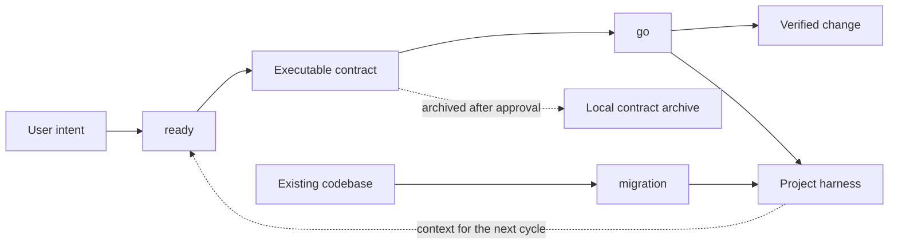

<a id="top"></a>

<div align="center">


# dryforge

### A bounded-autonomy plugin harness for Claude Code and Codex.

<h2>Your agent works like a senior developer.</h2>

<p>Bounded autonomy, anchored in user-approved intent.</p>

<p>
  <a href="https://dryforge.vercel.app"></a>
  
  
  
</p>

<p>
  <a href="#install-and-update">Install</a> ·
  <a href="#system-definition">System</a> ·
  <a href="#operating-lifecycle">Lifecycle</a> ·
  <a href="#from-intent-to-authority">Intent</a> ·
  <a href="#spec-bound-execution">Execution</a> ·
  <a href="#evidence-backed-verification">Verification</a> ·
  <a href="#persistent-project-context">Context</a> ·
  <a href="#existing-project-migration">Migration</a> ·
  <a href="./README_ko.md">한국어</a>
</p>

</div>

## Install and Update

### Claude Code

```text
/plugin marketplace add fn-opt/dryforge
/plugin install dryforge
```

### Codex

```text
codex plugin marketplace add fn-opt/dryforge
codex plugin add dryforge@dryforge
```

### Updates

Codex checks for new releases at the start of each new session and applies them automatically.

Claude Code updates automatically when auto-update is enabled for dryforge under `/plugins -> installed -> dryforge -> auto-update`. Otherwise, update manually:

```text
# Claude Code
/plugin marketplace update dryforge
/plugin update dryforge@dryforge

# Codex
codex plugin marketplace upgrade dryforge
```

## System Definition

dryforge is not a bundle of a planner, an orchestrator, and a memory system. Those labels describe components, but they miss the system they implement.

dryforge is a bounded-autonomy plugin harness for capable coding agents. It provides an execution environment in which the model's decision authority, sources of truth, completion evidence, and persistent project context have explicit boundaries.

The model still does the reasoning. dryforge does not replace judgment with a prescribed workflow or attempt to enumerate every case the model may encounter. It defines the conditions under which judgment is safe to exercise:

| Authority source | Owns | Does not own |
|---|---|---|
| user | intent, preferences, and trade-off decisions | implementation mechanics |
| specification | behavior, invariants, scope, and interface contracts | scheduling |
| plan | work targets, dependency order, and execution structure | required behavior |
| code | current implementation facts and project conventions | desired behavior |
| evidence | whether execution is complete | what should have been built |
| project harness | durable project constraints and knowledge | unilateral intent for the current task |

This separation matters because agent failures are often authority failures disguised as reasoning failures. A model may infer an unstated product rule from a familiar pattern, treat current code as proof of intended behavior, reinterpret a specification to fit an easier implementation, or accept its own summary as evidence that the work succeeded. Each step can sound reasonable in isolation while moving the result away from the user's intent.

dryforge keeps those sources distinct and resolves conflicts deliberately. The user owns intent. The specification owns required behavior. Existing code provides implementation facts, not automatic product authority. Evidence, not confidence, owns completion.

The current specification and the project harness operate at different scopes. The specification governs one task; the harness governs durable project constraints. If a task must change an existing project constraint, neither source silently overrides the other. The user approves the change and both are brought back into agreement.



The plugin exposes three explicitly invoked entry points into this operating model:

| Entry point | Purpose | Produces |
|---|---|---|
| `ready` | resolves the decisions implied by the work and establishes implementation authority | an executable contract |
| `go` | executes the approved contract without silently redefining product intent; unresolved authority conflicts return to the user | verified changes and updated project context |
| `migration` | establishes trustworthy project context for an existing codebase | the initial project harness |

## Structural Failure Model

Modern coding models are already capable of producing substantial implementations. The recurring problem is not simply insufficient model capability. It is the structure around that capability.

An ordinary session begins with an input that is necessarily incomplete. The model fills gaps from training priors and the visible codebase, implements the resulting interpretation, evaluates the work from the same perspective that produced it, and leaves important rationale in a transcript. If the interpretation was wrong, the expensive correction happens after code exists. If the implementation was accepted, the next session inherits the code but not necessarily the reasons, rejected alternatives, operating constraints, or domain rules behind it.

Several failure pressures reinforce one another:

| Failure pressure | Typical consequence |
|---|---|
| underspecified intent | a plausible default becomes an unintended product decision |
| authority drift | code, a plan, or model preference overrides the user's actual requirement |
| self-validation | the same interpretation produces the work and certifies it |
| incentive drift | the agent satisfies visible gates or checklists instead of the underlying objective |
| context loss | future sessions reconstruct intent from incomplete implementation evidence |
| uniform process | trivial work pays unnecessary overhead while risky work receives insufficient scrutiny |

dryforge treats these as related system problems. Clarification, specification, execution, verification, and durable context are designed around a shared authority model rather than connected as independent utilities.

## Bounded Autonomy

Bounded autonomy means that the model has broad freedom inside an explicit authority boundary and no permission to silently move that boundary.

This is different from both a bare agent and a highly prescriptive harness. A bare agent has too much freedom at the point where the user's meaning is still incomplete. It can turn plausible defaults into invisible requirements. A prescriptive harness has the opposite problem: when the procedure becomes too detailed, the model can optimize for the procedure instead of the work.

dryforge uses a floor rather than a ceiling. It fixes the minimum conditions that must hold: intent must be grounded, behavior must have an authority source, dependencies must be explicit, completion must have evidence, and durable project knowledge must survive the run. Above that floor, the model remains free to reason, investigate, choose implementation techniques, and adapt to the actual codebase.

The floor is selective. Prose stays flexible where flexibility improves reasoning. Structure becomes rigid only where another process must consume it deterministically, such as the dependency graph used for execution. A requirement is recorded once at the correct authority level rather than repeated across several checklists that can drift apart.

The floor is also proportional. A small mechanical edit should not pay the coordination cost of a risky multi-part change. A thin idea, however, does not justify a thin specification: when less can be derived from the input, more intent must be established before implementation begins. Cost is reduced by removing work that does not change the outcome, not by lowering the evidence required for the outcome.

## Operating Lifecycle

For new work, `ready` and `go` form one continuous cycle:

```text
ready -> contract approval -> go -> result approval -> archive -> next cycle
```

The first cycle does more than describe the immediate task. It also captures the project-wide context needed to make the implementation coherent and to create the initial project harness. That context informs the work but does not expand the task's implementation scope.

On later cycles, `ready` begins from the existing harness and establishes authority only for the new change. After execution, `go` checks the completed implementation against the harness in both directions: project constraints must still be honored, and any constraint intentionally changed by the task must be updated where future agents will read it. Only the affected project context is revised.

`ready` and `go` are designed to run in the same session, but the executable contract remains the authority between them. The live conversation can help judgment; it cannot substitute for a missing or incomplete contract.

For an existing codebase, `migration` runs first as a separate onboarding cycle. Once the initial harness is established, the project joins the same `ready -> go` lifecycle as new work.

## From Intent to Authority

`ready` converts input into implementation authority. It is not a plan formatter and does not assume that a detailed input is correct merely because it is detailed.

Every input begins as material: an idea, a requirements document, a draft plan, generated text, design notes, or a mixture of them. Material may contain facts, preferences, proposed solutions, contradictions, and accidental assumptions. `ready` separates these before writing the specification so that improving the prose does not silently strengthen an unsupported claim.

Premature code or configuration in the input is treated the same way. Behavior that can be derived from it is translated into a behavioral contract; exact form is preserved only when that form is itself an intentional, non-reconstructible decision. Preservation is deliberately keep-biased: an executor can discard surplus source detail, but intent omitted from the contract is usually unrecoverable after the conversation ends.

The central task is to identify the decision surface of the requested change: the set of choices that materially alter behavior, data, boundaries, failure handling, security, or user experience. The model reasons broadly about that surface, but it does not turn every conceivable detail into a question.

Decisions are handled according to what can ground them:

| Decision type | Treatment |
|---|---|
| already implied by stated goals and constraints | derive it and preserve the reasoning |
| product, policy, or domain choice that remains open | ask the user precisely where the answer changes the result |
| technical choice with meaningful trade-offs | present concrete options and a recommendation |
| harmless implementation tuning | leave it to execution |

This asymmetry is deliberate. Product intent cannot be recovered reliably from an implementation after the fact, while many local implementation choices can. `ready` therefore spends user attention on decisions whose absence would force the agent to invent authority.

Question count is not a quality metric. The system first attempts to derive an answer from established goals, constraints, and code facts. It asks only when a specific unresolved decision remains, the existing material does not settle it, and choosing incorrectly would change the outcome. This produces fewer generic questions while making hidden, load-bearing assumptions visible.

The result is an executable contract: a durable statement of what must be true, how the work is divided, and which parts of the original intent cannot be reconstructed from code alone.

## The Executable Contract

The contract is stored as plain Markdown under `.dryforge` and has three responsibilities:

| Artifact | Responsibility |
|---|---|
| specification | authoritative behavior, constraints, invariants, edge cases, interfaces, and required verification |
| plan | implementation tasks, their behavioral contracts, and their dependency graph |
| handoff | document authority, execution boundaries, and intent that future executors must not re-derive |

The distinction prevents a common collapse in which requirements, implementation ideas, and scheduling notes are treated as equally authoritative. The specification defines the result. The plan describes how to reach it. If they disagree, the specification wins. If the specification itself appears wrong or incomplete during execution, the agent returns to the user rather than quietly correcting the authority source in its own favor.

The contract combines expressive prose with one machine-readable scheduling structure. Intent and constraints need language rich enough to preserve nuance. Dependency scheduling needs a deterministic graph that can be validated before work begins. Keeping rigidity at this seam allows the rest of the contract to remain readable and adaptable.

On the first cycle of a new project, the contract also establishes the project-wide foundation needed for future work. Later cycles read the existing project harness and focus the contract on the current change. This avoids repeatedly designing the project from scratch while keeping planned future work out of permanent project rules before it exists.

## Spec-Bound Execution

`go` treats the approved contract as execution authority. It may choose how to implement the work, investigate the repository, and adjust technical tactics, but it may not replace the specified behavior with a more convenient interpretation.

Before making expensive or stateful changes, `go` validates the contract, repository state, and dependency graph. This catches an invalid plan or unsafe base before execution creates more state to unwind. Independent tasks may run concurrently only after their dependencies and shared boundaries are explicit.

Execution scales with the work. Low-risk sequential changes can run directly. Risky work receives isolation and independent verification. Truly independent tasks can run concurrently, while external or stateful work must produce observable external evidence rather than relying on a file diff. Isolation is never assumed to cover shared services or runtime resources merely because file changes are separate.

Parallelism is an execution optimization, not a planning method. The system does not ask several agents to invent competing interpretations of an unresolved request. Direction is settled first; parallel work begins only when tasks can execute against the same approved contract.

Integration is treated as its own responsibility. A task is not accepted merely because a worker reports success. The actual changes and evidence are checked, dependencies are integrated in order, and the combined result is verified in the state the user would receive.

Final integration remains under user control. dryforge can prepare and verify the result without treating permission to implement as permission to rewrite history, merge an unapproved branch, or conceal a dirty base.

## Evidence-Backed Verification

Completion is an evidence claim, not a confidence statement.

Every execution path keeps an evidence floor. The exact evidence depends on the project and specification, but it must establish the asserted behavior rather than merely show that a command ran. Relevant evidence may include targeted tests, full test suites, type or build checks, inspected diffs, runtime smoke checks, external state reads, or other observable results.

An unevaluable check is a failure. If a command exits before reaching its assertion, a service cannot be observed, or an external operation leaves no inspectable result, the system does not infer success from the absence of a visible error.

Verification depth then rises with risk. Mechanical work can be checked directly. Changes involving state transitions, security boundaries, external systems, concurrency, or broad integration require stronger and more independent evidence. Affected-only checks can shorten intermediate feedback, but they do not replace the final project-level verification required by the contract.

dryforge also separates verification perspectives. The same context is not handed indiscriminately to every check, because more context can create anchoring rather than better judgment. One perspective can examine whether the written contract faithfully captures established intent. Another can judge whether the contract is complete enough to execute without access to the original conversation. Implementation checks work from raw changes and required behavior rather than an implementer's persuasive summary. Final verification sees the integrated result.

This is not review by repetition. Each perspective receives the evidence needed to find a different class of defect, and independence is preserved where self-confirmation would be most likely.

## Reward-Hack Resistance

Agent harnesses create incentives. Whatever is made easiest to observe can become the thing the model optimizes, even when it is only a proxy for the real work.

A detailed checklist can become a box-filling objective. A downstream review gate can encourage the upstream process to produce artifacts shaped to pass that gate. A generated project-document schema can cause the agent to write generic sections because the slots exist, whether or not the content has durable value. Adding more instructions does not necessarily fix these failures; it can make the proxy more elaborate.

dryforge addresses reward hacking structurally.

Responsibility stays upstream. Intent must be complete before the contract is authored, rather than delegated to a later reviewer. An implementer must produce evidence before integration, rather than relying on a final gate to discover missing work. Verification remains insurance, not the hidden specification.

Information is limited by purpose. Checks that should judge an artifact on its own are not given the author's full reasoning trail. Implementation is judged against required behavior and observable changes, not against the worker's account of why the result should be accepted.

Generated project context is selected by value rather than by template completion. Knowledge belongs in the harness when it changes future work and cannot be recovered cheaply and reliably from the repository. Empty ceremony, generic advice, and descriptions of dryforge itself do not become permanent project documentation.

The objective is not to constrain the model until it cannot take shortcuts. It is to arrange authority, evidence, and information so that the shortest valid path is aligned with the user's intended result.

## Cost Model

dryforge treats cost as resource allocation across the whole run: user attention, model context, generated output, subprocesses, review, retries, and wall-clock time.

The largest avoidable cost is often wrong-direction work. Clarifying a load-bearing decision before implementation is usually cheaper than implementing a plausible assumption, reviewing it, correcting it, and explaining the project again in the next session. The executable contract moves this cost forward, where it is smaller.

Persistent project context reduces recurring discovery. Future sessions do not need a full transcript or repeated repository archaeology to recover stable rules, operating constraints, and reasons that code cannot prove. The harness keeps high-value knowledge resident while allowing derivable detail to remain in the codebase.

Within a run, dryforge controls cost in several ways:

| Cost surface | Control |
|---|---|
| user attention | ask only when an unresolved decision has a concrete consequence |
| context usage | give each task and verification perspective only the material needed for its responsibility |
| model output | prefer structured results and silence between meaningful interaction points |
| agent dispatch | isolate or delegate only when independence, risk, or parallelism repays the coordination cost |
| wall-clock time | run truly independent tasks concurrently and reuse already-proven results where valid |
| retries | bound repeated attempts and escalate when new evidence is no longer being produced |

Cost controls never redefine success. A cached result can be reused only when it still proves the relevant state. A narrower check can accelerate an intermediate step but cannot certify unrelated integration. Parallelism is used only when shared runtime state does not turn it into contention or nondeterminism.

The aim is not minimal token use or maximal agent activity. It is the least total work that preserves authority and produces sufficient evidence.

## Persistent Project Context

The project harness is the durable context layer that future agents read before working. It is not a transcript summary or a single memory file. It is a small, project-owned documentation system placed at the entry points Claude Code and Codex already understand.

| State layer | Lifetime | Authority |
|---|---|---|
| executable contract | one task cycle | the current task |
| project harness | the project lifetime | durable project constraints and knowledge |

A typical harness may contain:

```text
your-project/
├── CLAUDE.md
├── AGENTS.md
├── docs/
│   ├── architecture.md
│   ├── business-rules.md
│   ├── security.md
│   ├── standards.md
│   ├── engineering-notes.md
│   ├── operations.md
│   ├── contracts.md
│   └── tracking/
└── <module>/AGENTS.md
```

The top-level documentation slots are stable; module-level instructions and retained content follow the project. The harness is not valuable because every slot exists. It is valuable because each retained statement changes how future work should be done.

Knowledge belongs in the harness when it is project-specific, consequential, and not reliably derivable from code or ordinary tooling. Typical examples include domain invariants, security policy, reasons behind architectural constraints, operational procedures, known traps, active decisions, and module boundaries. Source listings, obvious framework conventions, temporary implementation narration, and generic engineering advice do not qualify merely because they might be useful someday.

Each document stays at one level of abstraction and remains understandable on its own. Project-wide entry files route agents to the relevant context. Module-level instructions narrow the scope where local rules differ. Tracking material records durable state rather than replaying session activity.

The harness is updated from the actual completed change, not from the plan alone. This keeps permanent project context aligned with what now exists and avoids recording speculative future behavior as a current invariant.

Completed contracts are archived locally under `.dryforge`, while the project-facing harness remains ordinary, commit-ready Markdown. The generated documents describe the project, not dryforge. If the plugin is removed, the project keeps the useful asset without a proprietary runtime or document format.

## Existing-Project Migration

Existing projects need a different starting point. They already contain implementation history, documentation of uneven reliability, conventions, implicit owner knowledge, and possibly instructions created for other agent systems.

`migration` establishes the initial project harness without pretending that repository observation is the same as project truth.

The codebase is scanned as an observable ledger: structure, entry points, interfaces, data boundaries, tests, deployment mechanisms, and current behavior can often be established directly. Existing documentation is evaluated against the code and either retained, improved, folded into the new structure, or left out when it is stale or duplicative.

Inference is proportional to consequence. Low-risk technical facts can usually be derived and recorded. Product rules, business policy, security intent, and dangerous operational assumptions require owner confirmation when a false inference would mislead future work. Code can prove that an authorization check exists; it cannot prove that the current check expresses the complete intended policy.

The resulting harness is independently evaluated as project documentation: it must match the repository, preserve consequential owner knowledge, avoid unsupported claims, and remain useful without knowledge of the migration session.

Migration creates documentation and local initialization state. It does not treat onboarding as authorization to create commits, change branches, rewrite existing history, or begin unrelated implementation. After migration, the project uses the normal `ready -> go` cycle.

## Runtime Safety and Recovery

dryforge validates cheap preconditions before mutation. Contracts, dependency graphs, and repository state are checked before execution creates more state to unwind. External or stateful work must define observable evidence instead of borrowing confidence from a file diff.

When required evidence is missing, further execution stops. Failed isolated work is preserved for diagnosis, independently completed work is retained where safe, and temporary resources are not cleaned unless ownership is established. The system reports the last state it can actually prove instead of presenting a partially verified result as complete.

Retries are bounded by new information. Repeating the same failing action without a changed hypothesis, environment, or input is not progress. When the remaining decision belongs to the user or an external condition cannot be established, dryforge escalates with the evidence gathered so far.

Detection and diagnosis are separate responsibilities. The system must reliably detect that a required assertion was not proven; it does not fabricate a precise cause when the available evidence supports only a narrower conclusion.

## Interaction Model

dryforge runs only when explicitly invoked. It does not silently convert ordinary coding requests into its full workflow.

Conversation follows the user's language and stays focused on decisions, results, and blockers. Technical artifacts remain precise even when the conversation is informal. Internal control vocabulary is not pushed into user interaction unless a term is necessary to explain authority or make a decision.

The system is deliberately quiet between meaningful interaction points. Progress narration is not a substitute for useful state, and large internal analyses are summarized into the information the user needs to approve, correct, or continue the work.

dryforge is most useful for features, project setup, migrations, and changes where a wrong assumption or weak verification would be expensive. Tiny, fully specified mechanical edits usually do not need the complete cycle.

## Portability and Source Integrity

dryforge is stack- and language-independent. It discovers the repository's actual tools, conventions, and verification methods at runtime rather than encoding one framework's workflow into the product.

Claude Code and Codex distributions are generated from the same platform-neutral skill source, with platform-specific packaging for their respective plugin systems.

The same portability principle applies to project output. Contracts and project context use plain Markdown and standard agent entry files. The project remains understandable and operable without dryforge-specific document readers.

## Requirements

> [!IMPORTANT]
> Git is required. Before `go` executes, the tracked working state must be clean; when the main branch tracks a remote, it must not contain unpushed commits. This keeps unrelated work out of the execution and verification boundary.

## License

MIT

<div align="center"><sub><a href="#top">back to top</a> · ready / go / migration</sub></div>
