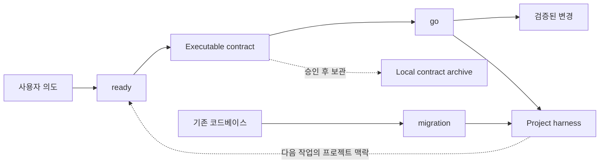

<a id="top"></a>

<div align="center">


# dryforge

### Claude Code와 Codex를 위한 bounded-autonomy 플러그인 하네스.

<h2>Your agent works like a senior developer.</h2>

<p>Bounded autonomy, anchored in user-approved intent.</p>

<p>
  <a href="https://dryforge.vercel.app"></a>
  
  
  
</p>

<p>
  <a href="#install-and-update">설치</a> ·
  <a href="#system-definition">시스템</a> ·
  <a href="#operating-lifecycle">생명주기</a> ·
  <a href="#from-intent-to-authority">의도</a> ·
  <a href="#spec-bound-execution">실행</a> ·
  <a href="#evidence-backed-verification">검증</a> ·
  <a href="#persistent-project-context">프로젝트 맥락</a> ·
  <a href="#existing-project-migration">마이그레이션</a> ·
  <a href="./README.md">English</a>
</p>

</div>

<a id="install-and-update"></a>

## 설치 및 업데이트

### Claude Code

```text
/plugin marketplace add fn-opt/dryforge
/plugin install dryforge
```

### Codex

```text
codex plugin marketplace add fn-opt/dryforge
codex plugin add dryforge@dryforge
```

### 업데이트

Codex는 새 세션을 시작할 때 새 릴리스를 확인하고 자동으로 적용합니다.

Claude Code는 `/plugins -> installed -> dryforge -> auto-update`에서 자동 업데이트를 켤 수 있습니다. 자동 업데이트를 사용하지 않는다면 다음 명령으로 직접 갱신합니다.

```text
# Claude Code
/plugin marketplace update dryforge
/plugin update dryforge@dryforge

# Codex
codex plugin marketplace upgrade dryforge
```

<a id="system-definition"></a>

## dryforge가 정의하는 것

dryforge는 planner, orchestrator, memory tool을 한데 묶은 제품이 아닙니다. 이 이름들은 일부 기능을 설명할 수는 있지만, 그 기능들이 구현하는 시스템까지 설명하지는 못합니다.

dryforge는 강한 코딩 에이전트를 위한 bounded-autonomy 플러그인 하네스입니다. 모델이 어디까지 판단해도 되는지, 서로 다른 정보가 충돌할 때 무엇을 기준으로 삼는지, 무엇이 완료의 증거인지, 어떤 프로젝트 지식이 세션 이후에도 남아야 하는지를 명시한 실행 환경을 제공합니다.

실제 추론은 모델이 합니다. dryforge는 가능한 상황을 전부 나열하거나 판단을 정해진 절차로 대체하지 않습니다. 대신 모델이 안전하게 판단하기 위해 반드시 지켜야 할 경계를 정합니다.

| Authority source | 정하는 것 | 정하지 않는 것 |
|---|---|---|
| user | 의도, 선호, trade-off | 구현 세부 방식 |
| spec | 동작, 불변 조건, 범위, 외부 계약 | 작업 순서 |
| plan | 작업 대상, dependency 순서, 실행 구조 | 요구 동작 |
| code | 현재 구현 사실과 프로젝트 관례 | 앞으로 원하는 동작 |
| evidence | 실행이 실제로 완료되었는지 | 무엇을 만들었어야 하는지 |
| project harness | 프로젝트 전체에 지속되는 제약과 지식 | 현재 작업의 의도를 독자적으로 결정하는 일 |

에이전트의 실패는 추론 능력의 부족보다 판단 기준의 혼선에서 시작되는 경우가 많습니다. 익숙한 패턴을 근거로 말하지 않은 제품 규칙을 만들어 내거나, 현재 코드를 의도된 동작의 증거로 오해하거나, 구현하기 쉬운 방향으로 명세를 다시 해석하거나, 자신의 설명을 완료 증거로 받아들일 수 있습니다. 각각은 그럴듯해 보여도 결과를 사용자의 의도에서 멀어지게 합니다.

dryforge는 이 근거들을 섞지 않습니다. 의도는 사용자가 정하고, 요구 동작은 승인된 명세가 정합니다. 코드는 현재 구현을 보여주지만 원하는 동작의 정본은 아닙니다. 완료는 자신감이 아니라 증거로 판단합니다.

현재 작업의 명세와 프로젝트 하네스는 서로 다른 범위를 다룹니다. 명세는 이번 작업의 기준이고, 프로젝트 하네스는 프로젝트 수명 동안 유지되는 제약입니다. 이번 작업이 기존 제약을 바꿔야 한다면 어느 한쪽이 조용히 다른 쪽을 덮어쓰지 않습니다. 사용자가 변경을 승인하고 spec과 project harness를 함께 갱신해 다시 일치시킵니다.



플러그인은 이 운영 모델에 들어가는 세 진입점을 제공하며, 모두 사용자가 명시적으로 호출합니다.

| 진입점 | 역할 | 결과 |
|---|---|---|
| `ready` | 작업이 암시하는 결정을 확정하고 실행 기준을 세웁니다 | executable contract |
| `go` | 승인된 계약을 실행하되 제품 의도를 독자적으로 다시 정의하지 않습니다. 기준이 충돌하면 사용자에게 돌아옵니다 | 검증된 변경과 갱신된 프로젝트 맥락 |
| `migration` | 기존 코드베이스에 신뢰할 수 있는 프로젝트 맥락을 세웁니다 | 첫 project harness |

## 구조적 실패 모델

오늘날의 코딩 모델은 이미 상당한 규모의 구현을 수행할 수 있습니다. 반복되는 문제는 단순히 모델의 능력이 부족해서가 아니라, 그 능력을 둘러싼 작업 구조에 있습니다.

일반적인 세션은 필연적으로 불완전한 입력에서 시작합니다. 모델은 학습된 패턴과 눈앞의 코드로 빈칸을 채우고, 그 해석을 구현한 뒤, 같은 관점에서 결과까지 평가합니다. 결정의 중요한 이유는 대화 기록에 남습니다. 해석이 틀렸다면 비용이 큰 수정은 이미 코드가 생긴 뒤에 일어나고, 구현이 받아들여졌다면 다음 세션에는 결과만 남고 이유는 사라집니다.

여러 실패 압력이 서로를 강화합니다.

| 실패 압력 | 결과 |
|---|---|
| underspecified intent | 그럴듯한 default가 사용자가 원하지 않은 제품 결정이 됩니다 |
| authority drift | code, plan, 모델의 선호가 사용자의 요구를 덮어씁니다 |
| self-validation | 같은 해석이 결과를 만들고 그 결과가 맞다고 판정합니다 |
| incentive drift | 실제 목표보다 눈에 보이는 gate나 checklist를 만족시키게 됩니다 |
| context loss | 다음 세션이 불완전한 코드 증거만 보고 의도를 다시 추론합니다 |
| uniform ceremony | 작은 작업에는 과한 비용을 쓰고, 위험한 작업에는 충분한 검증을 하지 못합니다 |

dryforge는 이를 서로 분리된 문제가 아니라 하나의 시스템 문제로 다룹니다. 의도 확인, 명세, 실행, 검증, 지속되는 프로젝트 맥락은 모두 같은 판단 권한 모델 위에서 동작합니다.

## Bounded Autonomy

Bounded autonomy는 모델이 명시된 판단 권한 안에서는 폭넓게 판단하되, 그 경계 자체를 조용히 넓히지는 못하게 하는 방식입니다.

순정 에이전트와 지나치게 처방적인 하네스는 서로 반대 방향에서 실패합니다. 순정 에이전트는 사용자의 의미가 아직 불완전한 시점에 너무 많은 자유를 가집니다. 그래서 익숙하고 합리적인 기본값을 보이지 않는 요구사항으로 만들 수 있습니다. 반대로 절차를 지나치게 자세히 정한 하네스는 모델을 실제 작업보다 절차 자체에 최적화시킵니다.

dryforge는 `floor, not ceiling` 원칙을 사용합니다. 의도에는 근거가 있어야 하고, 동작에는 정본이 있어야 하며, dependency는 명시되어야 하고, 완료에는 evidence가 있어야 하며, 중요한 프로젝트 지식은 실행 이후에도 남아야 합니다. 이 floor 위에서는 모델이 코드베이스를 조사하고, 구현 방식을 고르고, 실제 상황에 맞게 판단할 자유를 가집니다.

엄격함은 필요한 지점에만 둡니다. 풍부한 설명이 필요한 의도와 제약은 유연한 산문으로 기록합니다. 다른 프로세스가 항상 같은 의미로 읽어야 하는 dependency graph만 엄격한 구조를 사용합니다. 같은 요구사항을 여러 checklist에 반복해 서로 어긋나게 만들지 않고, 올바른 기준 문서에 한 번 기록합니다.

절차의 크기도 작업에 맞춥니다. 작은 기계적 수정이 위험하거나 여러 작업이 얽힌 변경과 같은 조율 비용을 낼 필요는 없습니다. 그러나 입력이 짧다는 이유로 명세까지 얇아져서는 안 됩니다. 입력에서 도출할 수 있는 내용이 적을수록 구현 전에 더 많은 의도를 확정해야 합니다. 비용은 결과에 영향을 주지 않는 작업을 줄여서 낮추며, 결과를 증명하는 기준을 낮추지는 않습니다.

<a id="operating-lifecycle"></a>

## 작업 생명주기

새 작업에서 `ready`와 `go`는 하나의 연속된 사이클을 이룹니다.

```text
ready -> 계약 승인 -> go -> 결과 승인 -> 보관 -> 다음 작업
```

프로젝트의 첫 사이클은 당장의 작업만 정의하지 않습니다. 현재 구현이 프로젝트 전체와 어울리도록 필요한 기반 맥락도 함께 확정하고, 이를 첫 프로젝트 하네스의 재료로 사용합니다. 이 맥락은 구현 판단에 영향을 주지만 현재 작업의 범위를 임의로 넓히지는 않습니다.

이후 사이클에서 `ready`는 기존 프로젝트 하네스를 읽고 새 변경에 필요한 의도만 확정합니다. 실행이 끝나면 `go`는 완료된 구현과 하네스를 양방향으로 확인합니다. 기존 프로젝트 제약을 지켰는지 확인하고, 이번 작업이 제약을 의도적으로 바꿨다면 다음 에이전트가 읽을 문서도 함께 갱신합니다. 작업 범위와 관련된 프로젝트 맥락만 수정합니다.

`ready`와 `go`는 같은 세션에서 이어서 실행하도록 설계되어 있습니다. 대화에 남은 맥락은 판단을 도울 수 있지만, 실행 가능한 계약을 대신할 수는 없습니다. 두 단계 사이의 실제 기준은 대화가 아니라 승인된 계약입니다.

기존 코드베이스는 별도의 온보딩 사이클로 `migration`을 먼저 실행합니다. 첫 프로젝트 하네스를 만든 뒤에는 새 프로젝트와 같은 `ready -> go` 생명주기에 합류합니다.

<a id="from-intent-to-authority"></a>

## 의도에서 실행 기준까지

`ready`는 입력을 실행의 기준으로 바꿉니다. `plan`을 보기 좋게 정리하는 도구가 아니며, 문서가 자세하다는 이유만으로 그 내용을 옳다고 가정하지도 않습니다.

모든 입력은 ground truth가 아니라 검토할 material로 들어옵니다. 한 줄짜리 아이디어, 요구사항 문서, 초안 plan, 모델이 만든 글, 설계 메모, 이들이 뒤섞인 자료에는 사실과 선호, 제안된 해법, 모순, 우연히 들어간 가정이 함께 있을 수 있습니다. `ready`는 spec을 쓰기 전에 이를 분리합니다. 문장을 다듬는 과정에서 근거 없는 주장이 사실처럼 승격되는 일을 막기 위해서입니다.

입력에 너무 일찍 작성된 code나 configuration이 있어도 같은 원칙을 적용합니다. 그 안에서 도출할 수 있는 동작은 behavioral contract로 바꾸고, 특정한 형태 자체가 사용자의 의도이거나 나중에 다시 복원할 수 없는 경우에만 원형을 보존합니다. 보존 여부가 애매하면 남기는 쪽을 택합니다. 남은 세부사항은 실행자가 버릴 수 있지만, contract에서 빠진 의도는 대화가 끝난 뒤 되살리기 어렵기 때문입니다.

핵심은 이번 변경의 `decision surface`를 찾는 일입니다. 동작, 데이터, 경계, 실패 처리, 보안, 사용자 경험을 실질적으로 바꾸는 결정의 전체 범위를 내부적으로 넓게 살펴보되, 생각할 수 있는 모든 세부사항을 질문으로 바꾸지는 않습니다.

결정은 근거를 가진 주체에 따라 다르게 처리합니다.

| 결정의 종류 | 처리 방식 |
|---|---|
| 이미 밝혀진 목표와 제약에서 도출할 수 있는 결정 | 다시 묻지 않고 도출하며 필요한 이유를 보존합니다 |
| 아직 열려 있는 제품, 정책, 도메인 결정 | 답에 따라 결과가 달라지는 지점을 정확히 짚어 사용자에게 묻습니다 |
| trade-off가 큰 기술 결정 | 구체적인 선택지, 장단점, 추천안을 제시합니다 |
| 결과를 바꾸지 않는 구현 튜닝 | 실행 단계의 판단에 맡깁니다 |

이 비대칭은 의도적입니다. 제품 의도는 구현이 끝난 뒤 code만 보고 신뢰성 있게 복원하기 어렵지만, 많은 세부 구현 선택은 code에서 다시 도출할 수 있습니다. `ready`는 답이 없을 때 에이전트가 판단 권한을 만들어 내야 하는 결정에만 사용자의 판단을 요청합니다.

질문의 개수는 품질 지표가 아닙니다. 먼저 확정된 목표, 제약, code fact에서 답을 도출합니다. 그래도 특정 결정이 남고, 기존 자료로 답할 수 없으며, 잘못 선택했을 때 결과가 달라지는 경우에만 묻습니다. 그래서 일반적인 질문은 줄어들고, 나중에 비용이 큰 오해가 될 가정은 더 잘 드러납니다.

결과는 보기 좋아진 plan이 아닙니다. 무엇이 반드시 참이어야 하는지, 작업을 어떻게 나누는지, code만으로 다시 복원할 수 없는 의도가 무엇인지를 담은 `executable contract`입니다.

## 실행 가능한 계약

`executable contract`는 `.dryforge` 아래의 일반 Markdown 파일 세 개로 저장되며 서로 다른 책임을 가집니다.

| 문서 | 책임 |
|---|---|
| `spec` | 요구 동작, 제약, invariant, edge case, 외부 interface, 필수 검증의 정본 |
| `plan` | 구현 작업, 각 작업의 behavioral contract, dependency graph |
| `handoff` | 문서 간 우선순위, 실행 경계, 실행자가 다시 추론해서는 안 되는 의도 |

이 구분은 요구사항과 구현 아이디어, 작업 순서가 모두 같은 권위를 갖는 혼선을 막습니다. `spec`은 결과를 정의하고 `plan`은 그 결과에 도달하는 방법을 설명합니다. 둘이 충돌하면 `spec`이 우선합니다. 실행 중 `spec` 자체가 잘못되었거나 불완전해 보인다면 에이전트가 편한 방향으로 고치지 않고 사용자에게 돌아갑니다.

계약은 자유로운 prose와 machine-readable한 scheduling core를 함께 사용합니다. 의도와 제약에는 뉘앙스를 보존할 수 있는 언어가 필요하고, dependency scheduling에는 실행 전에 검증 가능한 결정적 graph가 필요합니다. 엄격한 형식은 이 경계에만 두어 나머지 문서를 사람이 읽고 수정하기 쉽게 유지합니다.

새 프로젝트의 첫 사이클에서는 이후 작업에 필요한 프로젝트 전체의 기반도 계약에 포함합니다. 다음 사이클부터는 프로젝트 하네스가 그 역할을 이어받고 계약은 현재 변경에 집중합니다. 프로젝트를 매번 처음부터 설계하지 않으면서도, 아직 구현되지 않은 미래 계획이 현재의 영구 규칙으로 굳는 일을 막습니다.

<a id="spec-bound-execution"></a>

## 명세 경계 안의 실행

`go`는 승인된 contract를 실행의 기준으로 사용합니다. 구현 방법을 고르고, 저장소를 조사하고, 구현 전략을 조정할 수는 있지만, 요구 동작을 구현하기 편한 해석으로 바꿀 수는 없습니다.

비용이 크거나 상태를 바꾸는 작업에 들어가기 전에 contract, repository state, dependency graph를 검증합니다. 잘못된 plan이나 안전하지 않은 base state를 더 많은 변경이 생기기 전에 발견합니다. 서로 독립적인 작업은 dependency와 공유 경계가 명시된 뒤에만 동시에 실행할 수 있습니다.

실행 방식은 작업의 성격에 맞게 달라집니다. 위험이 낮은 순차 작업은 직접 실행할 수 있습니다. 위험한 작업에는 격리와 독립 검증을 추가합니다. 실제로 독립적인 작업은 병렬로 실행하고, 결과가 파일 diff로 남지 않는 외부 상태 작업은 관찰 가능한 외부 증거를 요구합니다. 파일 변경이 분리되어 있다는 이유만으로 서비스, 데이터베이스, 포트 같은 공유 실행 환경까지 격리되었다고 가정하지 않습니다.

병렬 실행은 실행 단계의 최적화이지 계획을 세우는 방법이 아닙니다. 여러 에이전트가 아직 정해지지 않은 요구를 제각각 추측하게 하지 않습니다. 방향을 먼저 확정하고, 모든 작업이 같은 계약을 실행할 수 있을 때만 병렬화를 사용합니다.

통합도 별도의 책임으로 다룹니다. 작업자가 완료했다고 보고했다는 이유만으로 결과를 받아들이지 않습니다. 실제 변경과 evidence를 확인하고, dependency 순서에 맞게 통합한 뒤, 사용자가 받게 될 통합 상태에서 다시 검증합니다.

최종 통합 권한은 사용자에게 남습니다. 구현을 허용했다는 이유로 history rewrite, 승인되지 않은 branch merge, 관련 없는 dirty state의 은폐까지 허용된 것으로 해석하지 않습니다.

<a id="evidence-backed-verification"></a>

## 증거 기반 검증

완료는 자신감에 대한 주장이 아니라 증거에 대한 주장입니다.

모든 실행 경로에는 `evidence floor`가 있습니다. 어떤 evidence가 필요한지는 프로젝트와 `spec`에 따라 달라지지만, 명령을 실행했다는 사실이 아니라 주장한 동작을 실제로 입증해야 합니다. targeted test와 full test suite, type check, build, diff 확인, runtime smoke, 외부 상태 조회처럼 관찰 가능한 결과를 사용합니다.

평가할 수 없었던 검사는 실패로 취급합니다. 검증 명령이 assertion에 도달하기 전에 종료되거나, 서비스를 관찰할 수 없거나, 외부 작업의 결과를 확인할 방법이 없다면 눈에 띄는 오류가 없다는 이유로 성공을 추론하지 않습니다.

그 위에서 위험에 따라 검증 깊이를 높입니다. 기계적인 변경은 직접 확인할 수 있습니다. 상태 전이, 보안 경계, 외부 시스템, 동시성, 넓은 통합 범위를 건드리는 변경에는 더 강하고 독립적인 증거가 필요합니다. 변경된 범위만 검사하는 방식은 중간 피드백을 빠르게 만들 수 있지만, 계약이 요구하는 최종 프로젝트 검증을 대신하지는 않습니다.

검증 관점도 서로 분리합니다. 모든 검사에 같은 맥락을 통째로 제공하면 이해가 깊어지는 대신 기존 해석에 끌려갈 수 있습니다. 한 관점은 작성된 계약이 확정된 의도를 제대로 담았는지 봅니다. 다른 관점은 원래 대화를 보지 않고도 계약만으로 실행할 수 있는지 판단합니다. 구현 검증은 작업자의 설득력 있는 설명보다 실제 변경과 요구 동작을 봅니다. 마지막 검증은 통합된 전체 결과를 봅니다.

같은 리뷰를 여러 번 반복하는 구조가 아닙니다. 각 관점은 서로 다른 결함을 찾는 데 필요한 정보만 받고, 자기확증의 위험이 큰 지점에서는 독립성을 유지합니다.

## 보상 해킹 저항

에이전트 하네스는 의도하지 않아도 보상 구조를 만듭니다. 가장 쉽게 관찰할 수 있는 항목이 실제 작업의 대리 지표가 되고, 모델이 그 지표를 목적처럼 최적화할 수 있습니다.

자세한 checklist는 칸 채우기 목표가 될 수 있습니다. 뒤에 강한 gate가 있으면 앞단은 그 gate를 간신히 통과하는 산출물로 수렴할 수 있습니다. 생성할 프로젝트 문서의 틀을 먼저 보여주면 실제로 남길 가치가 있는지와 관계없이 빈 섹션을 채우게 될 수 있습니다. 지시를 더 많이 추가한다고 해결되지 않으며, 오히려 대리 목표만 정교해질 수 있습니다.

dryforge는 보상 해킹을 구조적으로 다룹니다.

책임을 뒤로 미루지 않습니다. 계약을 쓰기 전에 의도의 완전성을 앞단에서 책임지고, 구현 단계에서 통합 전에 증거를 만들도록 합니다. 마지막 검증은 드물게 빠져나온 결함을 잡는 안전장치이지, 앞단이 기대는 숨은 명세가 아닙니다.

정보도 목적에 맞게 제한합니다. 산출물 자체만 보고 판단해야 하는 검증에는 작성자의 전체 사고 과정을 제공하지 않습니다. 구현은 작업자가 들려주는 성공 서사가 아니라 요구 동작과 관찰 가능한 변경을 기준으로 평가합니다.

프로젝트 하네스에 남길 내용은 template의 빈칸이 아니라 가치로 고릅니다. 다음 작업을 실제로 바꾸고, 저장소에서 저렴하고 신뢰성 있게 다시 얻을 수 없는 지식만 남깁니다. 의례적인 문장, 어느 프로젝트에나 맞는 조언, dryforge 자체에 대한 설명은 영구 프로젝트 문서가 되지 않습니다.

목표는 모델이 shortcut을 택할 수 없을 때까지 구속하는 것이 아닙니다. 가장 짧은 유효 경로가 사용자가 의도한 결과와 일치하도록 판단 권한, 증거, 정보의 배치를 설계하는 것입니다.

## 비용 모델

dryforge는 비용을 토큰 하나의 문제가 아니라 전체 실행의 자원 배분 문제로 봅니다. 사용자의 주의, 모델 context, 출력, 에이전트 분리, subprocess, 검증, 재시도, 전체 소요 시간을 함께 다룹니다.

가장 큰 낭비는 잘못된 방향으로 만든 뒤 되돌리는 작업인 경우가 많습니다. 중요한 결정을 구현 전에 확인하는 비용은, 그럴듯한 가정을 구현하고 검토하고 고치고 다음 세션에서 다시 설명하는 비용보다 작습니다. `executable contract`는 이 비용을 더 저렴한 시점인 앞단으로 옮깁니다.

지속되는 프로젝트 맥락은 반복적인 탐색 비용을 줄입니다. 다음 세션은 안정된 규칙, 운영 제약, code가 증명하지 못하는 이유를 찾기 위해 전체 대화 기록을 다시 읽거나 저장소를 처음부터 조사하지 않아도 됩니다. 가치가 높은 지식은 project harness에 남기고, 다시 도출할 수 있는 세부사항은 code에 맡깁니다.

한 번의 실행 안에서도 여러 비용을 따로 관리합니다.

| 비용이 생기는 지점 | 제어 방식 |
|---|---|
| 사용자의 주의 | 답에 따라 결과가 달라지는 미결정만 묻습니다 |
| context 사용량 | 각 작업과 검증 관점이 맡은 책임에 필요한 자료만 제공합니다 |
| 모델 출력 | 구조화된 결과를 사용하고 의미 있는 상호작용 사이의 진행 중계는 생략합니다 |
| 에이전트 분리 | 독립성, 격리, 위험 제어, 실제 병렬성 중 하나를 얻을 때만 사용합니다 |
| 소요 시간 | 실제로 독립적인 작업을 동시에 실행하고, 여전히 유효한 검증 결과는 재사용합니다 |
| 재시도 | 새로운 evidence가 더 이상 나오지 않으면 반복을 멈추고 사용자 판단이 필요한 지점으로 escalate합니다 |

비용 절감이 성공의 정의를 바꾸지는 않습니다. 저장된 검증 결과는 여전히 현재 상태를 증명할 때만 재사용합니다. 좁은 검사는 중간 단계를 빠르게 만들 수 있지만 관련 없는 통합까지 인증할 수는 없습니다. 병렬화도 공유 실행 상태를 두고 경쟁하거나 비결정적인 결과를 만들지 않을 때만 사용합니다.

목표는 토큰을 가장 적게 쓰거나 에이전트를 가장 많이 동원하는 것이 아닙니다. 판단 권한을 지키고 충분한 증거를 만들기 위해 필요한 전체 작업량을 최소화하는 것입니다.

<a id="persistent-project-context"></a>

## 지속되는 프로젝트 맥락

프로젝트 하네스는 다음 에이전트가 작업 전에 읽는 지속적인 맥락 계층입니다. 한 세션을 요약한 transcript나 단일 memory file이 아닙니다. 프로젝트가 소유하며, Claude Code와 Codex가 이미 읽는 진입점에 놓이는 작은 문서 시스템입니다.

| 상태 계층 | 수명 | 기준이 되는 범위 |
|---|---|---|
| executable contract | 한 번의 작업 cycle | 현재 작업 |
| project harness | 프로젝트 전체 수명 | 지속되는 프로젝트 제약과 지식 |

프로젝트 하네스는 다음과 같은 일반적인 구조를 가집니다.

```text
your-project/
├── CLAUDE.md
├── AGENTS.md
├── docs/
│   ├── architecture.md
│   ├── business-rules.md
│   ├── security.md
│   ├── standards.md
│   ├── engineering-notes.md
│   ├── operations.md
│   ├── contracts.md
│   └── tracking/
└── <module>/AGENTS.md
```

최상위 문서의 역할은 안정적으로 유지되고, 모듈별 지침과 실제 내용은 프로젝트에 맞게 달라집니다. 모든 칸을 채웠다는 사실에는 가치가 없습니다. 각 문장을 읽은 다음 에이전트의 작업이 실제로 달라져야 합니다.

프로젝트에 특화되어 있고, 결과에 영향을 주며, 코드나 일반 도구에서 신뢰성 있게 다시 얻을 수 없는 지식만 하네스에 남깁니다. 도메인 불변 조건, 보안 정책, 아키텍처 제약의 이유, 운영 절차, 알려진 함정, 현재 결정, 모듈 경계가 여기에 해당합니다. 소스 파일 목록, 자명한 프레임워크 관례, 임시 구현 기록, 어느 프로젝트에나 맞는 일반론은 언젠가 유용할 수 있다는 이유만으로 남기지 않습니다.

각 문서는 하나의 추상화 수준을 유지하고, 다른 문서를 따라가야만 이해되는 조각이 아니라 그 자체로 읽을 수 있게 작성합니다. 프로젝트 전체의 진입 문서는 필요한 맥락으로 에이전트를 안내하고, 모듈별 문서는 해당 범위에만 적용되는 규칙을 설명합니다. `tracking` 문서는 세션 로그가 아니라 다음 작업에서도 유효한 상태만 기록합니다.

하네스는 계획이 아니라 실제로 완료된 변경에서 갱신합니다. 그래서 영구 프로젝트 맥락이 현재 코드와 맞게 유지되고, 아직 존재하지 않는 미래 동작이 현재의 불변 조건처럼 기록되지 않습니다.

완료된 계약은 `.dryforge` 아래에 로컬로 보관하고, 프로젝트가 읽는 하네스는 commit 가능한 일반 Markdown으로 남깁니다. 생성된 문서는 dryforge가 아니라 프로젝트 자체를 설명합니다. 나중에 플러그인을 제거해도 별도의 전용 런타임이나 문서 리더 없이 그대로 사용할 수 있습니다.

<a id="existing-project-migration"></a>

## 기존 프로젝트 전환

기존 프로젝트는 출발점이 다릅니다. 이미 구현 이력, 신뢰도가 제각각인 문서, 관례, 소유자만 아는 지식, 다른 에이전트 시스템이 만든 지침이 섞여 있습니다.

`migration`은 repository observation이 곧 project truth라고 가정하지 않고 첫 프로젝트 하네스를 세웁니다.

코드베이스의 구조, 진입점, 인터페이스, 데이터 경계, 테스트, 배포 방식, 현재 동작처럼 직접 확인할 수 있는 내용을 먼저 파악합니다. 기존 문서는 코드와 대조해 그대로 유지하거나, 개선하거나, 새 구조에 합치거나, 오래되었거나 중복되었다면 제외합니다. 기존 문서라는 이유만으로 자동으로 권위를 갖지는 않습니다.

추론은 틀렸을 때의 결과에 비례해 사용합니다. 위험이 낮은 기술적 사실은 code에서 도출해 기록할 수 있습니다. 제품 규칙, 비즈니스 정책, 보안 의도, 위험한 운영 가정은 잘못 이해했을 때 다음 작업을 망칠 수 있으므로 소유자의 확인이 필요합니다. Authorization check의 현재 동작은 code에서 확인할 수 있지만, 그것이 의도한 전체 policy인지까지 code가 증명하지는 못합니다.

완성된 하네스는 독립적인 프로젝트 문서로 다시 평가합니다. 저장소와 맞는지, 결과에 영향을 주는 소유자 지식을 보존했는지, 근거 없는 주장이 없는지, migration 대화를 몰라도 사용할 수 있는지를 확인합니다.

`migration`은 문서와 로컬 초기화 상태를 만듭니다. 온보딩을 commit 생성, branch 변경, history rewrite, 관련 없는 구현을 시작할 권한으로 해석하지 않습니다. 완료 후 프로젝트는 일반적인 `ready -> go` 사이클을 사용합니다.

## 실행 안전과 복구

dryforge는 변경을 만들기 전에 저렴하게 확인할 수 있는 전제조건을 먼저 검증합니다. 먼저 contract, dependency graph, repository state를 확인해 불필요한 state가 쌓이기 전에 문제를 찾습니다. 외부 상태를 바꾸는 작업은 file diff에서 성공을 추정하지 않고 관찰 가능한 외부 evidence를 정의해야 합니다.

필수 증거가 없다면 이후 실행을 멈춥니다. 실패한 격리 작업은 진단할 수 있도록 보존하고, 독립적으로 완료된 작업은 안전한 경우 유지합니다. 소유권을 확인하지 않은 임시 자원을 함부로 정리하지 않습니다. 일부만 검증된 결과를 완료라고 보고하는 대신, 실제로 증명할 수 있는 마지막 상태를 명확히 알립니다.

재시도는 새로운 정보가 생길 때만 의미가 있습니다. 가설, 환경, 입력이 달라지지 않았는데 같은 실패를 반복하는 것은 진행이 아닙니다. 남은 결정이 사용자에게 있거나 외부 조건을 확인할 수 없다면 지금까지 수집한 증거와 함께 판단을 요청합니다.

Detection과 diagnosis도 구분합니다. 요구한 동작이 증명되지 않았다는 사실은 확실히 탐지하되, 가진 evidence보다 더 구체적인 원인을 만들어 내지는 않습니다.

## 사용자 상호작용

dryforge는 사용자가 명시적으로 호출할 때만 실행됩니다. 평범한 코딩 요청을 조용히 전체 워크플로로 바꾸지 않습니다.

대화는 사용자의 언어를 따르고 결정, 결과, blocker에 집중합니다. 대화가 편한 말투여도 기술 산출물은 정확성을 유지합니다. 판단이나 의사결정에 필요하지 않은 내부 단계명과 제어 용어를 사용자에게 노출하지 않습니다.

의미 있는 상호작용 사이에는 의도적으로 조용합니다. 진행 중계를 늘려도 사용자에게 필요한 정보가 늘어나지는 않습니다. 내부 분석은 사용자가 승인하거나, 수정하거나, 다음 단계로 넘어가는 데 필요한 정보로 압축합니다.

기능 개발, 프로젝트 초기 설정, migration, 잘못된 가정이나 약한 검증의 비용이 큰 변경에 가장 잘 맞습니다. 작고 완전히 정해진 기계적 수정에는 전체 사이클이 필요하지 않을 수 있습니다.

## 이식성과 단일 소스

dryforge는 특정 stack이나 언어에 종속되지 않습니다. 한 프레임워크의 작업 방식을 제품에 고정하지 않고, 실제 저장소에서 도구, 관례, 검증 방법을 실행 시점에 발견합니다.

Claude Code와 Codex 배포물은 같은 platform-neutral skill source에서 생성되며, 각 플랫폼의 플러그인 체계에 필요한 packaging만 다르게 적용합니다.

프로젝트에 남기는 결과도 같은 원칙을 따릅니다. 계약과 프로젝트 맥락은 일반 Markdown과 표준 에이전트 진입 파일을 사용합니다. dryforge 전용 문서 리더가 없어도 프로젝트를 이해하고 운영할 수 있습니다.

## 요구사항

> [!IMPORTANT]
> Git이 필요합니다. `go`를 실행하기 전에 tracked working tree가 clean해야 하며, main branch가 remote를 추적한다면 push하지 않은 commit이 없어야 합니다. 그래야 관련 없는 작업이 실행과 검증의 경계 안으로 섞이지 않습니다.

## 라이선스

MIT

<div align="center"><sub><a href="#top">맨 위로</a> · ready / go / migration</sub></div>
